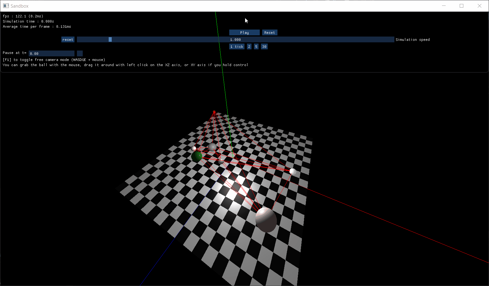

# Brief

Simple 3d game engine written in c++ as part of a personnal project student done at Keimyung University.

# Demos

## Collisions between multiple sphere colliders, linked by springs :
Every ball are linked by springs to every other balls, and is influenced by the gravity.

## Multiple independant balls bouncing off the floor in a windy level :
Each individual ball is influenced by gravity and a wind pushing them to the side. The balls bounce off the floor and an invisible wall at the edge of the level 

## Real-time interraction with mouse :
Each ball is drag-and-droppable with the mouse.

# Features

## Rendering
Basic rendering system works with OpenGl. 
It supports :
- basic shapes (sphere / cube / plane)
- complex object which can be loaded from files like `.obj` using [assimp library](https://github.com/assimp/assimp)
- 3d lines
- Transparent objects
- Textures

All the UI is done using [ImGui](https://github.com/ocornut/imgui)

## Physic
Basic non-deterministic hand-crafted physic engine.
It supports :
- Collisions between sphere and plane colliders
- Custom user-defined constraint (such as the bridge ropes / sticks)

# How it works

The entire project uses c++20.

I use [entt](https://github.com/skypjack/entt) as entity-component system.

The physic engine is a basic contrainst resolver between collision which iterates 50 times every tick.
The only two type of collider supported are infinite planes and spheres.  
Collisions only affect object's velocity, and leaves the rotation velocity untouched. The rotation velocity changes are still in progress, as well a box colliders. 

All the rendering is done with OpenGl for the game, and [ImGui](https://github.com/ocornut/imgui) for the UI.

Asset loading is done with [assimp](https://github.com/assimp/assimp)

